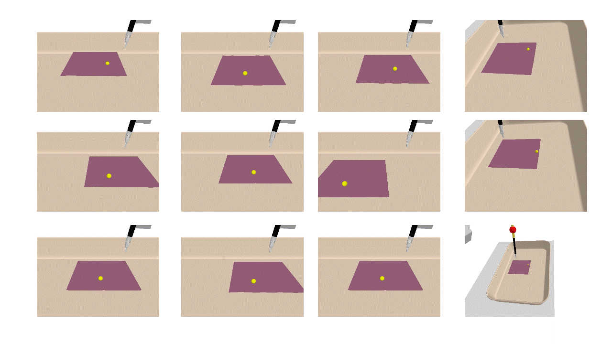
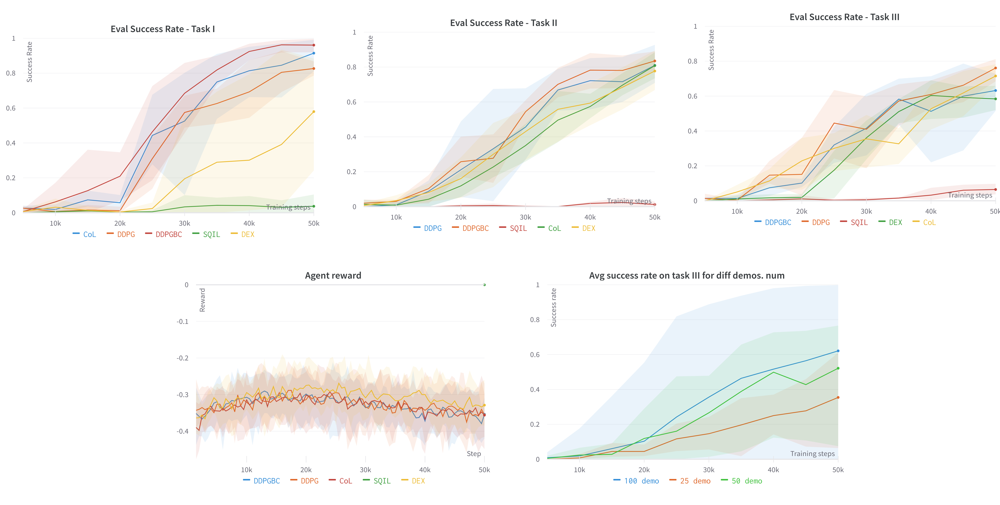

# Autonomous Soft Tissue Retraction Using Demonstration-Guided Reinforcement Learning

**Amritpal Singh\***, Wenqi Shi, May D. Wang  
*Georgia Institute of Technology and Emory University*  
MICCAI 2023 – AE-CAI Workshop

[**🔗 Project Page**](https://amritpal-001.github.io/tissueretract/) | [**📄 Paper on arXiv**](https://arxiv.org/abs/2309.00837) | [**💻 Code Repository**](https://github.com/Amritpal-001/tissue_retract)


## 🚨 Code Released! 🛠️🚧  

---



## Abstract

Autonomous surgical subtask execution remains an open problem in surgical robotics, and **soft tissue retraction** is a canonical example: it is repetitive, physically demanding, and a prerequisite for exposing the surgical field in many procedures, yet it has received comparatively little attention relative to rigid-body manipulation tasks. Prior work in surgical automation has largely targeted **rigid body manipulation** or relied on expensive **physical tissue phantoms**, limiting reproducibility and scale. Soft tissue introduces additional challenges: high-dimensional, deformable state and sparse rewards, that make standard reinforcement learning (RL) sample-inefficient and unreliable.

We address this gap with a **ROS-compatible**, **PyBullet**-based simulation environment supporting both rigid and soft body interactions, built to study and train RL agents for real-world surgical robot systems such as the **Da Vinci Surgical System**. Within this environment, we study **demonstration-guided reinforcement learning** as a means of improving sample efficiency and task performance on soft tissue retraction, and benchmark it against standard RL baselines. This repository provides the simulation environment, task suite, and training code used in our study, to support reproducible research on autonomous surgical subtask learning.

## Features

- ✅ Simulation of soft tissue and anchor points using the PyBullet physics engine  
- ✅ Integration with the Robot Operating System (ROS)  
- ✅ Demonstration-guided RL for improved performance on soft tissue tasks  
- ✅ Baseline comparison with standard reinforcement learning algorithms  
- ✅ Reproducible framework for in silico experiments

## Environments
TissueRetract-v0: Single anchor point + vertical retraction
TissueRetract-v1: Single anchor point + Any directional retraction
TissueRetract-v2: Single anchor point + Pixel based env

## Key Contributions

- A novel simulation-based approach for training surgical robots in soft tissue manipulation  
- A benchmark comparing demonstration-guided RL with traditional RL techniques  
- An open-source, extensible platform for research in autonomous surgical robotics


# Installation Instructions

1. Clone this repository.
```bash
git clone --recursive https://github.com/Amritpal-001/tissue_retract.git
cd tissue_retract
```

2. Create a virtual environment
```bash
conda create -n tissue_retract python=3.8
conda activate tissue_retract
```

3. Install packages

```bash
# install surrol environments
pip3 install -e SurRoL/	   
pip3 install -r requirements.txt
pip3 install -e .
```

4. Then add one line of code at the top of `gym/gym/envs/__init__.py` to register SurRoL tasks:

```python
# directory: anaconda3/envs/tissue_retract/lib/python3.8/site-packages/
import surrol.gym
```

# Test installation
- Single run as per Expert policy:
```bash
python SurRoL/surrol/tasks/tissue_retract.py 
```


# Run

### 1.1 Data generate
Generate demonstartion data:
python SurRoL/surrol/data/data_generation.py --env TissueRetract-v0 --episodes 50 --render_mode="numpy"

For batch runs, add all subtypes in ./01_data_generate.sh file, like following

python SurRoL/surrol/data/data_generation.py --env TissueRetract-v0 --episodes 50 --render_mode="numpy"
python SurRoL/surrol/data/data_generation.py --env TissueRetract-v1 --episodes 50 --render_mode="numpy"
python SurRoL/surrol/data/data_generation.py --env TissueRetract-v2 --episodes 50 --render_mode="numpy"


```bash
chmod u+x 01_data_generate.sh
./01_data_generate.sh
```
<!-- TissueRetract-v4: Non-Goal env -->

### 1.2 Train algorithm

```bash
python3 train.py task=TissueRetract-v0 agent=ddpgbc use_wb=True num_demo=100 n_train_steps=50_001 seed=1 n_eval_episodes=50
```

- Train in batch
```bash
chmod u+x 01_run_train.sh
./01_run_train.sh
```


# Acknowledgements
This work is built over the amazing surrol library and uses DEX library as reference for algorithms.
- SURROL
- DEX - https://github.com/med-air/DEX


## Results



## Citation

If you find this work useful in your research, please cite:

```
@inproceedings{singh2023softtissuerl,
  title={Autonomous Soft Tissue Retraction Using Demonstration-Guided Reinforcement Learning},
  author={Singh, Amritpal and Shi, Wenqi and Wang, May D.},
  booktitle={AE-CAI Workshop, MICCAI},
  year={2023}
}
```

## Contact
For questions or collaborations, reach out to **Amritpal Singh** – ap4.singh@gmail.com
